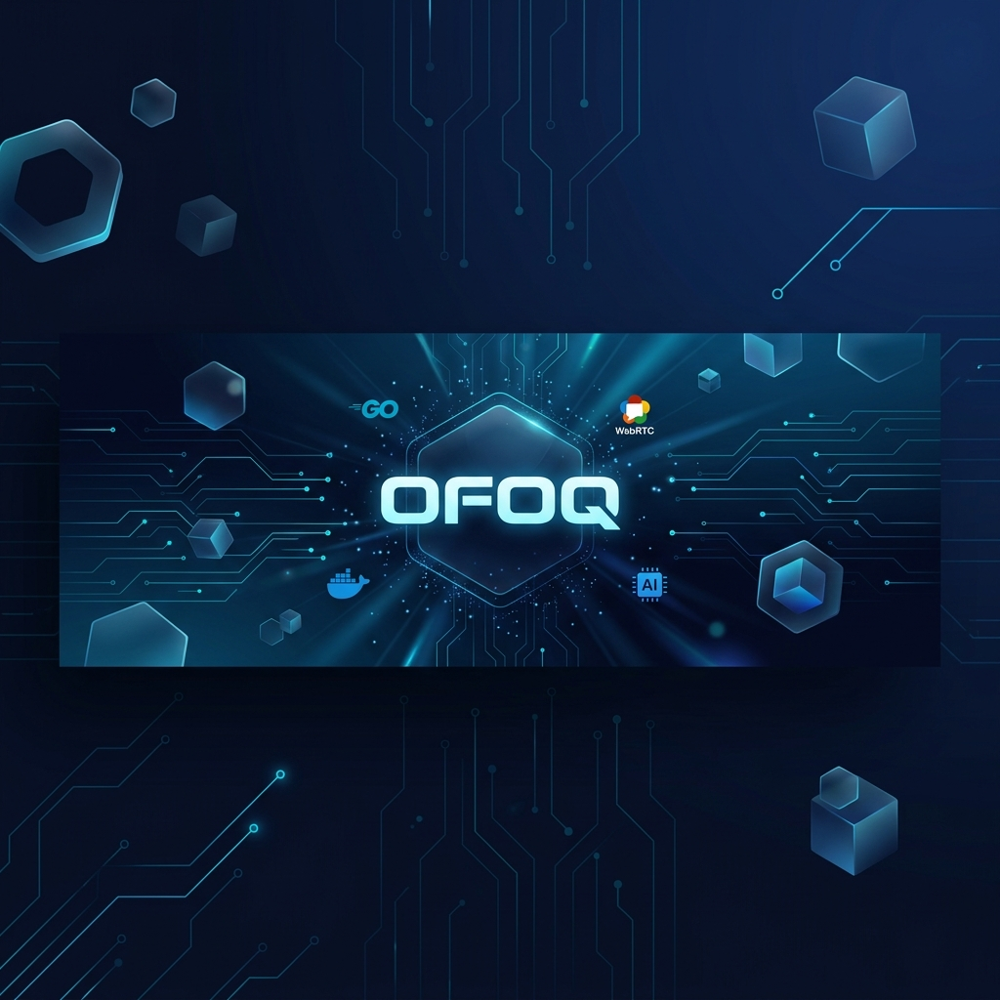
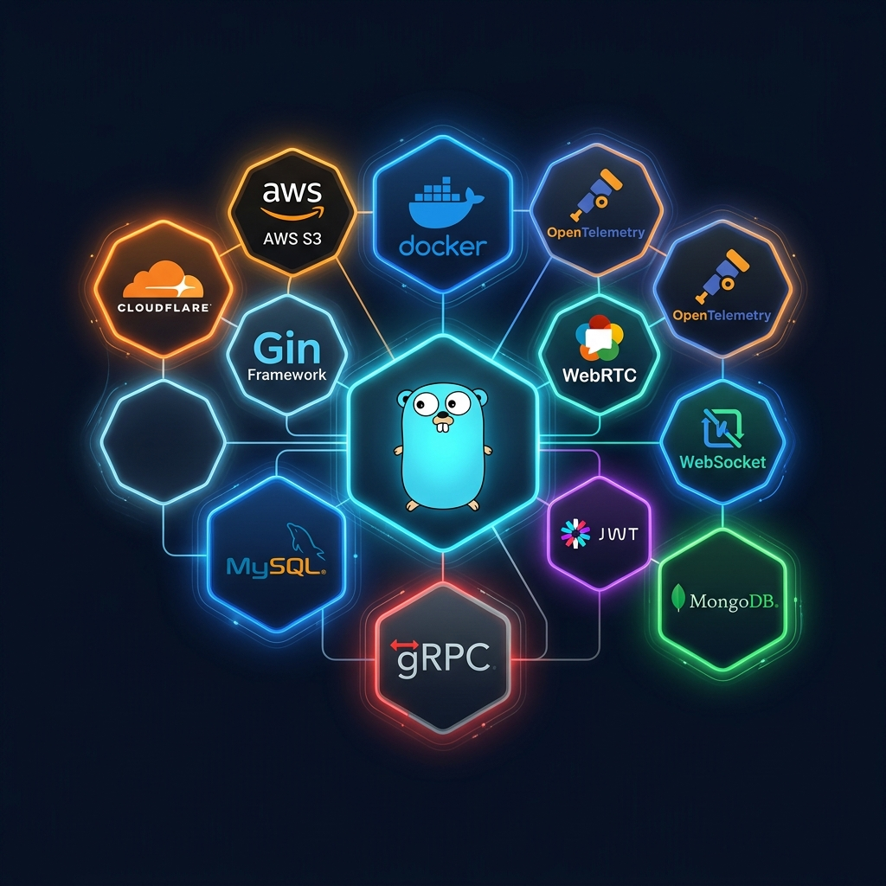
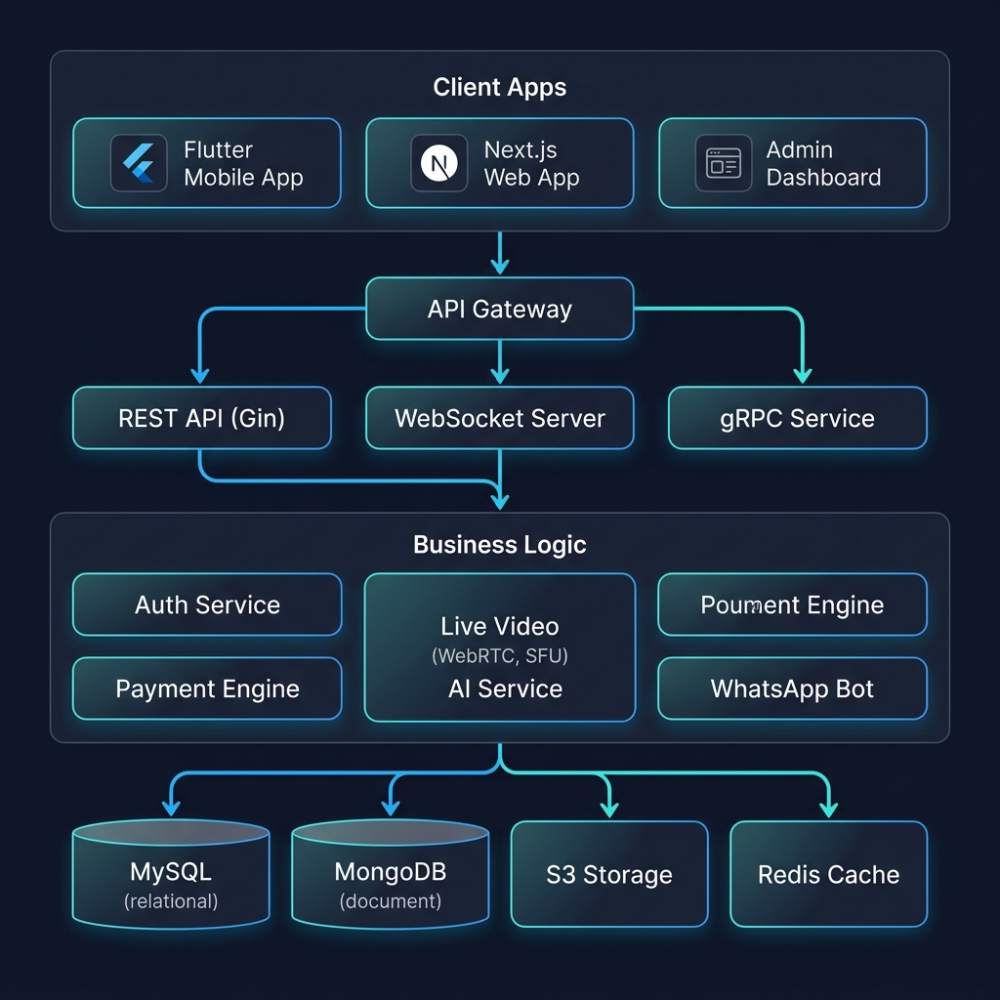
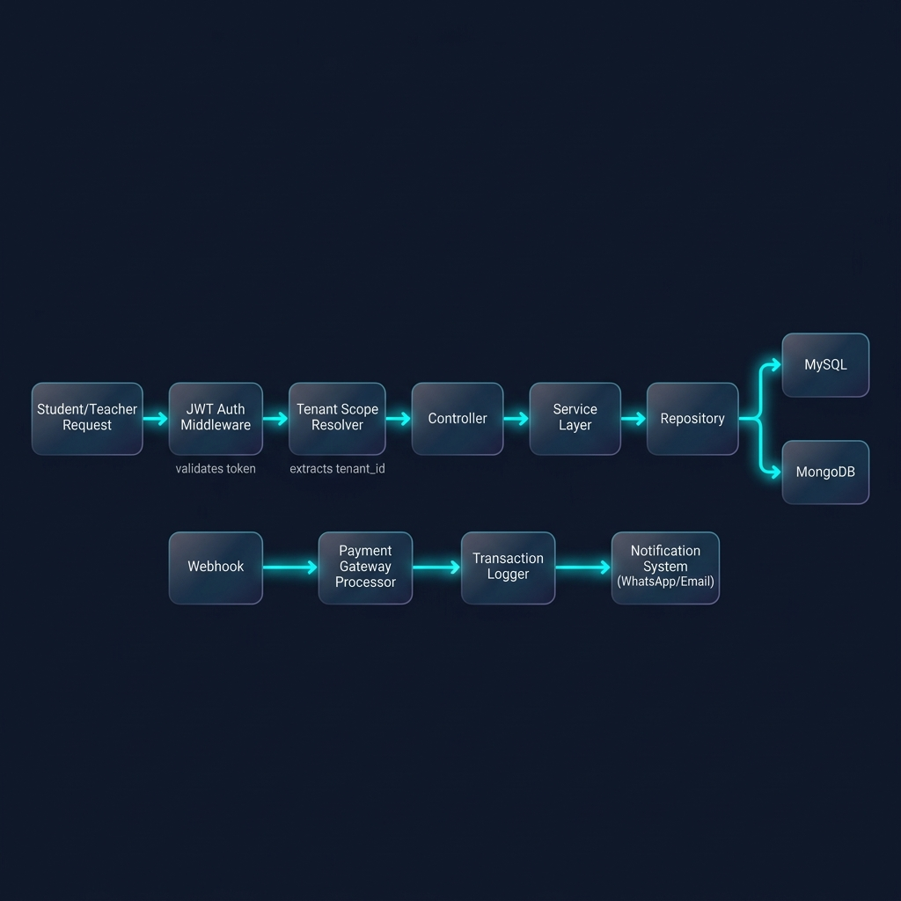
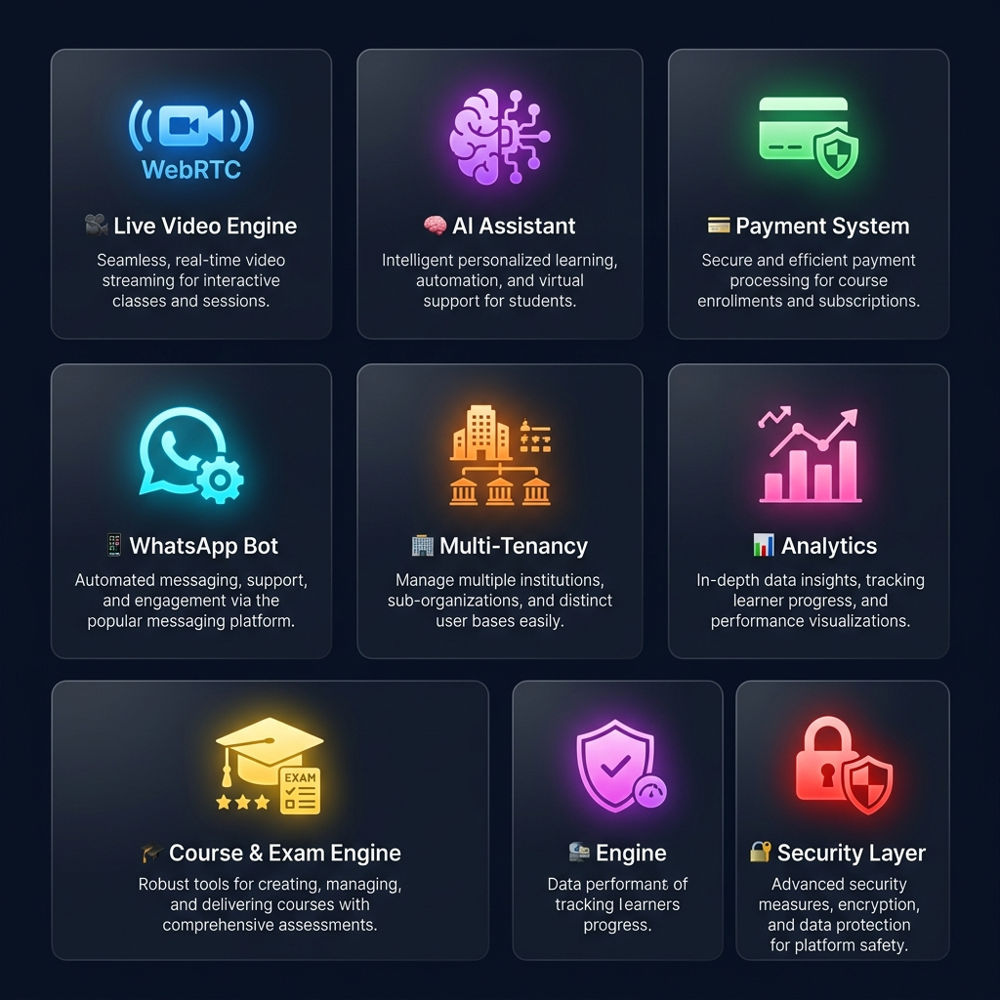

<div align="center">

<!-- ═══════════════════════════════════════════════════════ -->
<!--                    🚀 HERO SECTION                      -->
<!-- ═══════════════════════════════════════════════════════ -->



<br><br>

# 🌌 منصة أُفُق — OFOQ Platform

### `Enterprise-Grade Multi-Tenant SaaS Backend`

<br>

<p align="center">
  <strong>بنية تحتية سحابية عالية الأداء مصممة من الصفر لإدارة منصات تعليمية رقمية ذكية — بث حي، اختبارات تفاعلية، دفع إلكتروني، ذكاء اصطناعي، وأتمتة واتساب — كل ذلك بنظام Multi-Tenant يخدم آلاف المستأجرين بعزل كامل للبيانات.</strong>
</p>

<br>

[](https://go.dev/)
[]()
[]()
[]()
[]()

<br>

---

<br>

> ### 🎯 *"ليس مجرد Backend — بل معمارية Enterprise كاملة مبنية بفلسفة هندسية صارمة، حيث كل سطر كود يخدم هدفاً، وكل طبقة تحمي التي تليها."*

<br>

</div>

<!-- ═══════════════════════════════════════════════════════ -->
<!--                 📊 QUICK STATS                          -->
<!-- ═══════════════════════════════════════════════════════ -->

<div align="center">

<table>
<tr>
<td align="center"><h3>🗂️</h3><strong>54+</strong><br><sub>نموذج بيانات (Model)</sub></td>
<td align="center"><h3>🎮</h3><strong>32</strong><br><sub>Controller</sub></td>
<td align="center"><h3>🛣️</h3><strong>120+</strong><br><sub>API Endpoint</sub></td>
<td align="center"><h3>🔐</h3><strong>5</strong><br><sub>Authentication Guards</sub></td>
<td align="center"><h3>📦</h3><strong>54</strong><br><sub>Database Migration</sub></td>
<td align="center"><h3>🧩</h3><strong>9</strong><br><sub>Service Domains</sub></td>
</tr>
</table>

</div>

<br>

---

<br>

<!-- ═══════════════════════════════════════════════════════ -->
<!--               🛠 TECH STACK SECTION                     -->
<!-- ═══════════════════════════════════════════════════════ -->

<div dir="rtl" align="right">

## 🛠 الترسانة التقنية (Tech Stack)

</div>

<div align="center">



<br><br>

</div>

<div align="center">

| الطبقة | التقنيات |
|:---:|:---|
| **⚙️ اللغة الأساسية** | [](https://go.dev/) |
| **🏗️ إطار العمل** | [](https://goravel.dev/) [](https://gin-gonic.com/) |
| **🗄️ قواعد البيانات** | [](https://mysql.com/) [](https://mongodb.com/) |
| **📡 البروتوكولات** | [](https://grpc.io/) []() [-333333?style=flat-square&logo=webrtc&logoColor=white)](https://pion.ly/) |
| **🔒 الحماية** | []() []() |
| **☁️ البنية السحابية** | [](https://docker.com/) [-569A31?style=flat-square&logo=amazons3&logoColor=white)]() []() |
| **📊 المراقبة** | [](https://opentelemetry.io/) []() |
| **🤖 الذكاء الاصطناعي** | []() |
| **💬 التواصل** | []() []() |

</div>

<br>

---

<br>

<!-- ═══════════════════════════════════════════════════════ -->
<!--          🏗 SYSTEM ARCHITECTURE SECTION                 -->
<!-- ═══════════════════════════════════════════════════════ -->

<div dir="rtl" align="right">

## 🏗 البنية الهندسية العميقة (System Architecture)

</div>

<div align="center">



</div>

<br>

<div dir="rtl" align="right">

تم تصميم النظام وفق مبادئ **Clean Architecture** الصارمة مع نمط **Service-Repository Pattern** المُعزز بـ **Dependency Injection**. الهدف؟ نظام يمكن لأي مهندس جديد فهمه في دقائق، وتوسيعه في ساعات، من دون كسر أي شيء.

### 🔄 مخطط تدفق الطلبات (Request Lifecycle)

</div>

<div align="center">



</div>

<br>

<div dir="rtl" align="right">

```
📱 Client Request
    ↓
🔐 JWT Auth Middleware ← (يتحقق من الهوية ونوع المستخدم)
    ↓
🏢 Tenant Scope Resolver ← (يعزل البيانات تلقائياً حسب المستأجر)
    ↓
🎯 Controller ← (يستقبل ويُحقق صحة البيانات الواردة)
    ↓
⚙️ Service Layer ← (ينفذ Business Logic المعقد)
    ↓
🗃️ Repository Layer ← (يتعامل مع قاعدة البيانات بتجريد كامل)
    ↓
┌─────────────┬─────────────┐
│   MySQL     │  MongoDB    │
│ (Relational)│ (Document)  │
└─────────────┴─────────────┘
```

### 🧬 استراتيجية قاعدة البيانات الهجينة (Dual-Database Strategy)

| | MySQL | MongoDB |
|:---|:---|:---|
| **الغرض** | البيانات العلائقية الحرجة | البيانات غير المهيكلة والضخمة |
| **أمثلة** | المستخدمين، المعاملات المالية، الاشتراكات | اللوقات، بيانات التحليلات، الجلسات |
| **الميزة** | ACID Compliance + Foreign Keys | مرونة عالية + أداء قراءة سريع |
| **ORM** | GORM (Goravel) | Native MongoDB Driver |

</div>

<br>

---

<br>

<!-- ═══════════════════════════════════════════════════════ -->
<!--        📂 DIRECTORY STRUCTURE SECTION                   -->
<!-- ═══════════════════════════════════════════════════════ -->

<div dir="rtl" align="right">

## 📂 التشريح الهيكلي للمشروع (Project Anatomy)

استُخدمت فلسفة **Domain-Driven Directory Structure** لتنظيم المشروع بشكل يعكس مجالات العمل الحقيقية:

</div>

```
ofoq_backend/
│
├── 📁 app/                           # 💎 القلب النابض (Domain Core)
│   ├── 📁 http/
│   │   ├── 📁 controllers/           # 🎮 32 Controller (نقاط دخول الطلبات)
│   │   │   ├── ai_chat_controller          → محادثة AI تفاعلية
│   │   │   ├── ai_wallet_controller        → إدارة محافظ نقاط الذكاء الاصطناعي
│   │   │   ├── analytics_controller        → لوحة تحليلات متقدمة
│   │   │   ├── assignment_controller       → نظام الواجبات والتسليم
│   │   │   ├── attendance_controller       → الحضور والغياب بالـ QR
│   │   │   ├── course_controller           → إدارة الكورسات والفصول والدروس
│   │   │   ├── exam_controller             → محرك الامتحانات التفاعلي
│   │   │   ├── live_engine_controller      → محرك البث المباشر WebRTC
│   │   │   ├── payment_controller          → بوابات الدفع الديناميكية
│   │   │   ├── tenant_controller           → إدارة المستأجرين (Multi-Tenant)
│   │   │   ├── video_controller            → رفع ومعالجة الفيديوهات السحابية
│   │   │   ├── voucher_controller          → نظام كروت الشحن والإيصالات
│   │   │   ├── whatsapp_controller         → ربط وإدارة واتساب
│   │   │   └── ... (20+ controllers أخرى)
│   │   ├── 📁 middleware/             # 🛡️ طبقة الحراسة والأمن
│   │   │   ├── auth.go                     → JWT Multi-Guard Authentication
│   │   │   └── check_ai_balance.go         → فحص رصيد AI قبل الاستهلاك
│   │   └── 📁 requests/              # ✅ Form Validation (تحقق صحة البيانات)
│   │       ├── auth/                       → تحقق بيانات التسجيل والدخول
│   │       ├── tenant/                     → تحقق عمليات المستأجر
│   │       ├── voucher/                    → تحقق عمليات الكروت
│   │       └── payout/                     → تحقق طلبات السحب المالي
│   │
│   ├── 📁 models/                     # 📊 54 نموذج بيانات (Data Entities)
│   │   ├── tenant.go                       → نموذج المستأجر الرئيسي
│   │   ├── tenant_ui_layout.go             → تخصيص واجهة كل مستأجر
│   │   ├── tenant_automation_setting.go    → إعدادات الأتمتة لكل مستأجر
│   │   ├── course.go / exam.go             → النظام التعليمي
│   │   ├── live_session.go                 → جلسات البث المباشر
│   │   ├── payment_gateway.go              → بوابات الدفع الديناميكية
│   │   ├── ai_wallet.go / ai_transaction   → نظام محافظ الذكاء الاصطناعي
│   │   └── whatsapp_instance.go            → ربط حسابات واتساب
│   │
│   ├── 📁 services/                   # ⚙️ 9 نطاقات خدمية (Service Domains)
│   │   ├── 📁 ai/                          → AI Wallet & Points Engine
│   │   ├── 📁 auth/                        → Multi-Guard Auth Logic
│   │   ├── 📁 live/                        → WebRTC SFU + Room Manager
│   │   ├── 📁 payment/                     → Payment Crypto + Engine
│   │   ├── 📁 realtime/                    → WebSocket Dashboard Hub
│   │   ├── 📁 tenant/                      → Tenant Lifecycle Manager
│   │   ├── 📁 video/                       → S3 Video Processor + SSE
│   │   ├── 📁 voucher/                     → Voucher Generation Engine
│   │   └── 📁 payout/                      → Withdrawal Request Processor
│   │
│   ├── 📁 repositories/              # 🗃️ Data Access Layer (DAL)
│   ├── 📁 scopes/                     # 🔒 Tenant/Student/Instructor Scopes
│   ├── 📁 events/                     # 📡 Event-Driven Architecture
│   ├── 📁 listeners/                  # 👂 Async Event Handlers
│   ├── 📁 facades/                    # 🎭 28 Facade (Service Locator Pattern)
│   ├── 📁 providers/                  # 💉 Dependency Injection Container
│   ├── 📁 exceptions/                 # ❌ Centralized Error Handling
│   └── 📁 utils/                      # 🧰 Shared Utilities
│
├── 📁 bootstrap/                      # 🚀 App Lifecycle & Bootstrapping
├── 📁 config/                         # ⚡ 14 ملف تهيئة مركزي
├── 📁 database/migrations/            # 📋 54 Migration File
├── 📁 routes/                         # 🛣️ API + Web + gRPC Routes
├── 🐳 Dockerfile                      # Multi-stage Alpine Build
├── 🐳 docker-compose.yml              # Container Orchestration
└── 📝 go.mod                          # 20+ Direct Dependencies
```

<br>

---

<br>

<!-- ═══════════════════════════════════════════════════════ -->
<!--           ⚡ ADVANCED FEATURES SECTION                  -->
<!-- ═══════════════════════════════════════════════════════ -->

<div dir="rtl" align="right">

## ⚡ المميزات الهندسية المتقدمة (Advanced Features)

</div>

<div align="center">



</div>

<br>

<div dir="rtl" align="right">

---

### 🏢 1. نظام الـ Multi-Tenancy (عزل البيانات التلقائي)

أخطر ميزة في أي نظام SaaS. تم تطبيق نمط **Automatic Query Scoping** على مستوى الـ ORM — يعني كل استعلام قاعدة بيانات يتم تصفيته تلقائياً حسب هوية المستأجر (Tenant) بدون أي تدخل يدوي من المطور. يمنع تسريب البيانات (Data Leakage) بنسبة 100%.

**ثلاث طبقات عزل:**
- 🔹 **TenantScope** — عزل بيانات كل مدرس/أكاديمية
- 🔹 **InstructorScope** — عزل البيانات على مستوى المدرس المالك
- 🔹 **StudentScope** — عزل بيانات كل طالب

---

### 🔐 2. نظام المصادقة المتعدد (Multi-Guard JWT Authentication)

نظام أمني يدعم **5 أنواع هوية مختلفة** كل منها بـ Guard خاص ونموذج مستقل:

| الحارس (Guard) | النوع | الدور |
|:---|:---|:---|
| `super_admin` | 👑 مدير النظام | تحكم كامل بالمنصة |
| `instructor` | 👨‍🏫 المدرس/المالك | إدارة الأكاديمية والمستأجر |
| `tenant_teacher` | 👩‍💻 مدرس مساعد | صلاحيات محدودة داخل المستأجر |
| `student` | 🎓 الطالب | الوصول لمحتوى المستأجر فقط |
| `user` | 👤 مستخدم عام | صلاحيات أساسية |

---

### 🎥 3. محرك البث المباشر (Live Video Engine — WebRTC SFU)

بنية **Selective Forwarding Unit** حقيقية مبنية بـ **Pion WebRTC** في Go:

```
🎬 المعلم (Publisher)
    ↓ WebRTC Stream
📡 SFU Router (مركز التوزيع)
    ↓ يوزع الفيديو بدون إعادة ترميز
┌────────────────────────┐
│ 👨‍🎓 طالب 1  │ 👩‍🎓 طالب 2  │ 👨‍🎓 طالب N │
└────────────────────────┘
```

**المكونات:**
- 📁 `sfu_router.go` — توجيه تدفقات الفيديو/الصوت
- 📁 `room_manager.go` — إدارة الغرف والمشاركين
- 📁 `websocket_handler.go` — إشارات التفاوض (Signaling)
- 💰 **نظام محفظة دقائق البث** — خصم تلقائي بالدقيقة

---

### 🧠 4. منظومة الذكاء الاصطناعي (AI Ecosystem)

نظام **AI Wallet** متكامل يعمل بنظام النقاط:

- 🪙 **محفظة نقاط AI** — كل مستأجر يشتري باقات نقاط
- 🤖 **محادثة AI تفاعلية** — تكامل مع Groq API بسرعة مذهلة
- 📝 **تقييم الواجبات بالـ AI** — الذكاء الاصطناعي يكتب ملاحظات للطلاب
- ⚖️ **Middleware فحص الرصيد** — يمنع الاستهلاك بدون رصيد كافٍ

---

### 💳 5. محرك الدفع الديناميكي (Dynamic Payment Gateway Engine)

تصميم **Plugin-Based Payment Architecture** يسمح لكل مستأجر بتفعيل بوابات دفع مختلفة:

```
🏪 Super Admin                    👨‍🏫 Instructor
    ↓                                  ↓
يضيف بوابات دفع عالمية         يفعل بوابات يحتاجها ويضع مفاتيحه
(Stripe, Paymob, Fawry...)      (Tenant-level Gateway Config)
                                       ↓
                               🎓 Student يدفع
                                       ↓
                               📡 Webhook يستقبل التأكيد
                                       ↓
                               ✅ يشحن رصيد الطالب تلقائياً
```

- 🔐 تشفير مفاتيح البوابات بـ **AES-256-GCM** (ملف `crypto.go`)
- 🪝 نظام **Webhook** ديناميكي لكل مستأجر وكل بوابة

---

### 📱 6. أتمتة واتساب (WhatsApp Automation Engine)

تكامل عميق مع **Evolution API** لأتمتة التواصل:

- 🔗 ربط رقم واتساب عبر QR Code تلقائي
- 📢 حملات رسائل جماعية (WhatsApp Campaigns)
- 🤖 طابور رسائل ذكي (Message Queue) لمنع الحظر
- 🪝 استقبال الرسائل الواردة عبر Webhook
- 📡 أحداث تلقائية (Event-Driven) — مثلاً: "طالب سجل → رسالة ترحيب تلقائية"

---

### 🎓 7. محرك التعليم المتكامل (Education Engine)

نظام تعليمي متكامل من الألف إلى الياء:

| النظام الفرعي | الميزات |
|:---|:---|
| **📚 الكورسات** | إنشاء، فصول، دروس، إعادة ترتيب، تسجيل طلاب |
| **📝 الامتحانات** | أسئلة متنوعة، محاولات متعددة، تصحيح تلقائي، تحليلات |
| **📊 تتبع التقدم** | تتبع تقدم كل طالب في كل درس |
| **📅 الجداول** | جداول دراسية + توليد تلقائي ذكي |
| **☑️ الحضور** | جلسات حضور + مسح QR Code |
| **📄 الواجبات** | إنشاء، تسليم، تقييم يدوي + تقييم AI |
| **🏆 المسابقات** | نظام نقاط + لوحة متصدرين (Leaderboard) |

---

### 📡 8. الـ Real-time Dashboard (لوحة القيادة الحية)

- 🔌 **WebSocket Hub** — يبث التحديثات اللحظية للمدرس
- 📊 **SSE (Server-Sent Events)** — لتتبع حالة رفع الفيديوهات
- 📈 **Analytics Engine** — تقارير متقدمة (ملخص، فيديو، تقارير شاملة)

---

### 🗄️ 9. نظام الفيديو السحابي (Cloud Video Pipeline)

```
📹 المدرس يرفع فيديو (حتى 500MB)
    ↓
⚙️ Video Processor (معالجة + ضغط)
    ↓
☁️ رفع على S3 (Backblaze B2)
    ↓
🌐 توزيع عبر Cloudflare Video Workers
    ↓
📱 الطالب يشاهد بأقل تأخير (Global CDN)
```

---

### 💰 10. النظام المالي (Financial System)

- 💳 **Voucher & Scratch Cards** — إنشاء دفعات كروت شحن
- 💵 **Instructor Wallet** — محفظة أرباح المدرس
- 🏦 **Payout System** — طلبات سحب الأرباح (موافقة Super Admin)
- 📊 **Financial Agreements** — اتفاقيات مالية مُخصصة لكل مستأجر
- 🔒 **Frozen Balance** — تجميد أرصدة الطلبات المعلقة

</div>

<br>

---

<br>

<!-- ═══════════════════════════════════════════════════════ -->
<!--           🔭 OBSERVABILITY SECTION                      -->
<!-- ═══════════════════════════════════════════════════════ -->

<div dir="rtl" align="right">

## 🔭 المراقبة وقابلية الملاحظة (Observability & Telemetry)

النظام مُجهز بنظام مراقبة شامل عبر **OpenTelemetry**:

</div>

<div align="center">

```
┌─────────────────────────────────────────────────────┐
│                  OpenTelemetry SDK                    │
├─────────────┬──────────────┬────────────────────────┤
│  📊 Metrics  │  🔍 Traces   │  📝 Logs              │
│  (قياسات)   │  (تتبع)      │  (سجلات)              │
├─────────────┼──────────────┼────────────────────────┤
│ OTLP gRPC   │ Zipkin       │ Stdout / OTLP HTTP    │
│ OTLP HTTP   │ OTLP gRPC    │ File Rotation         │
└─────────────┴──────────────┴────────────────────────┘
```

</div>

<br>

---

<br>

<!-- ═══════════════════════════════════════════════════════ -->
<!--          🐳 DEVOPS SECTION                              -->
<!-- ═══════════════════════════════════════════════════════ -->

<div dir="rtl" align="right">

## 🐳 بيئة التطوير والنشر (DevOps & Deployment)

</div>

<div align="center">

```
┌──────────────────────────────────────────────────────────────┐
│                    🏭 Production Pipeline                      │
├──────────────────────────────────────────────────────────────┤
│                                                               │
│  📝 Code Push                                                 │
│      ↓                                                        │
│  🐳 Docker Multi-Stage Build                                  │
│      ├── Stage 1: golang:alpine (Build + Compile)             │
│      │   └── Static Binary (--ldflags "-s -w")                │
│      └── Stage 2: alpine:latest (Runtime only)                │
│          └── Binary Size: ~67MB (stripped)                     │
│      ↓                                                        │
│  🚀 Deploy Container                                          │
│      └── Auto-restart: always                                 │
│                                                               │
└──────────────────────────────────────────────────────────────┘
```

</div>

<div dir="rtl" align="right">

| الميزة | الوصف |
|:---|:---|
| 🐳 **Docker Multi-Stage** | بناء مُحسن ينتج صورة خفيفة (~67MB Alpine) |
| 🔥 **Air Hot-Reload** | إعادة تشغيل تلقائي فوري عند أي تغيير بالكود |
| 🛡️ **Static Binary** | ملف واحد قابل للتنفيذ بدون أي تبعيات |
| 🎛️ **14 Config File** | تهيئة مركزية لكل الخدمات (DB, Auth, Cache, Queue, Mail, ...) |
| 📟 **Artisan CLI** | واجهة سطر أوامر لتوليد الكود والـ Migrations |
| 📊 **Swagger/OpenAPI** | توثيق API تلقائي ومتكامل |

</div>

<br>

---

<br>

<!-- ═══════════════════════════════════════════════════════ -->
<!--          🛣️ API STRUCTURE SECTION                       -->
<!-- ═══════════════════════════════════════════════════════ -->

<div dir="rtl" align="right">

## 🛣️ خريطة الـ API Endpoints

نظرة عامة على المسارات المتاحة في النظام عبر `/api/v1`:

</div>

<div align="center">

| الوحدة | المسارات | الحماية |
|:---|:---:|:---|
| 🔑 Super Admin Auth | `3` | Public + JWT |
| 👨‍🏫 Instructor Auth | `4` | Public + JWT |
| 🎓 Student Auth | `3` | Public + JWT |
| 🏢 Tenant Management | `10` | JWT (instructor) |
| 👩‍💻 Teacher Management | `2` | JWT (instructor) |
| 📚 Courses CRUD | `10` | Mixed |
| 📝 Exams System | `12` | Mixed |
| 📅 Schedules | `5` | Mixed |
| 🎥 Video System | `4` | JWT (instructor) |
| 📡 Live Sessions | `10` | JWT Multi-Guard |
| 💳 Payment System | `7` | Multi-Guard + Webhook |
| 🤖 AI System | `10` | JWT Multi-Guard |
| 📱 WhatsApp | `4` | JWT (instructor) |
| 💰 Vouchers | `4` | JWT Multi-Guard |
| 🏦 Payouts | `4` | JWT Multi-Guard |
| ☑️ Attendance | `5` | JWT Multi-Guard |
| 📄 Assignments | `7` | JWT Multi-Guard |
| 📊 Analytics | `3` | JWT (instructor) |
| ⚙️ System Config | `6` | JWT (super_admin) |
| **المجموع** | **120+** | |

</div>

<br>

---

<br>

<!-- ═══════════════════════════════════════════════════════ -->
<!--        👨‍💻 ABOUT THE ARCHITECT                          -->
<!-- ═══════════════════════════════════════════════════════ -->

<div align="center">

## 👨‍💻 المعمار وصانع المنصة

<br>


<br><br>

### زياد شلبي (Zeyad Shalaby) 👋

**`Senior Full-Stack Software Engineer & SaaS Architect`**

<br>

> *"مهمتي ليست تلقينك الكود، بل اختصار سنوات من التخبط والأخطاء، ووضعك على المسار المباشر والصحيح للاحتراف وجني الأرباح التقنية."*

<br>

</div>

<div dir="rtl" align="right">

### 🌟 البصمة الهندسية:

* 🚀 **مطور برمجيات شامل (Full-Stack)** — متخصص في بناء أنظمة Backend عالية الأداء وقابلة للتوسع بـ `Go` و `Laravel`، وواجهات مستخدم تفاعلية عبر `Next.js`، وتطبيقات موبايل بـ `Flutter`.
* 🧠 **عقلية هندسية صارمة** — جودة الكود، `Clean Architecture`، ومبادئ `SOLID` ليست مجرد كلمات — كل مشروع يخرج من يدي لازم يكون على أعلى مستوى.
* 🤝 **شريك نجاحك** — خلاصة خبراتي ومعاناتي في سوق العمل الحر مكثفة في هذا المعسكر — عشان تبدأ من حيث انتهيت أنا.
* 🌍 **رؤيتي** — تمكين جيل جديد من المطورين العرب لاقتحام السوق العالمي بأعمال تنافس أكبر الشركات التقنية.

</div>

<br>

<div align="center">

[](https://wa.me/201026097345)
[](mailto:me@zeyadshalaby.cloud)
[](https://github.com/zeyadshlb-dot)

</div>

<br>

---

<br>

<!-- ═══════════════════════════════════════════════════════ -->
<!--                 🔥 CONCLUSION                           -->
<!-- ═══════════════════════════════════════════════════════ -->

<div align="center">

## 🔥 الخلاصة

<br>

<table>
<tr>
<td width="33%" align="center">
<h3>🏗️</h3>
<strong>Enterprise Architecture</strong>
<br>
<sub>Clean Architecture + SOLID + DDD<br>مصمم للتوسع لملايين المستخدمين</sub>
</td>
<td width="33%" align="center">
<h3>⚡</h3>
<strong>Bleeding-Edge Tech</strong>
<br>
<sub>Go + WebRTC + gRPC + AI<br>تقنيات الصف الأول عالمياً</sub>
</td>
<td width="33%" align="center">
<h3>🛡️</h3>
<strong>Production Ready</strong>
<br>
<sub>Multi-Tenant + JWT + Scopes<br>جاهز لبيئة الإنتاج الحقيقية</sub>
</td>
</tr>
</table>

<br>

---

<br>


<br>

<strong>هندسة بشغف | كود بعقلية Enterprise | رؤية لمستقبل التعليم الرقمي العربي 💡</strong>

<br>

<sub>⭐ إذا أعجبك المشروع، لا تنسى تضغط Star — دعمك يحفزني لبناء المزيد!</sub>

</div>
